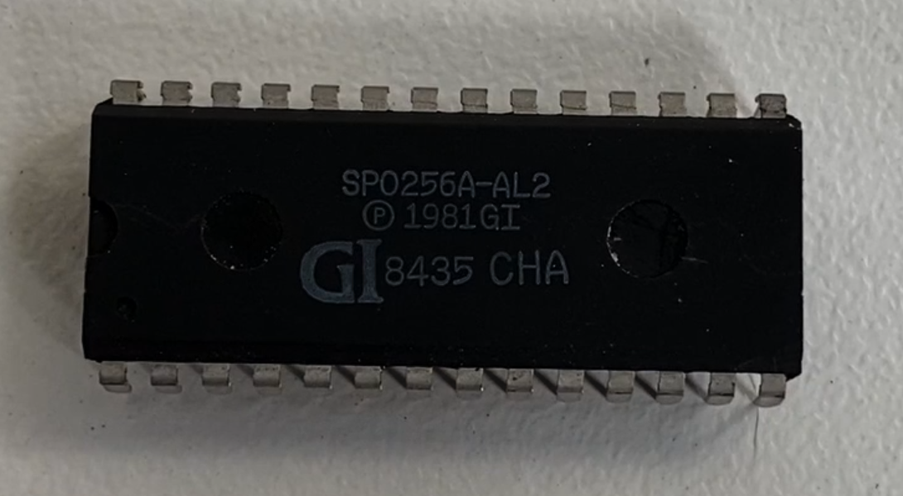

# Speech Processor using the SP0256-AL2

Code and design for the TEC Speech board that uses the SP0256A-AL2 chip.  This chip is hard to find now and there are many fakes out there so ensure you have an original.  Some fakes are the SP0256-012 (Mattel Chip) and some crash the system.  I've included a picture of the original chip.  You can get them from http://www.sciencestore.co.uk/acatalog/Electronics.html

This project demonstrates how to use the General Instruments SP0256-AL2 Speech Processor Chip.  Here you will find the original Talking Electronics publication detailing the project, Datasheets relating to the chip, Z80 source code and the text2allophone converter

